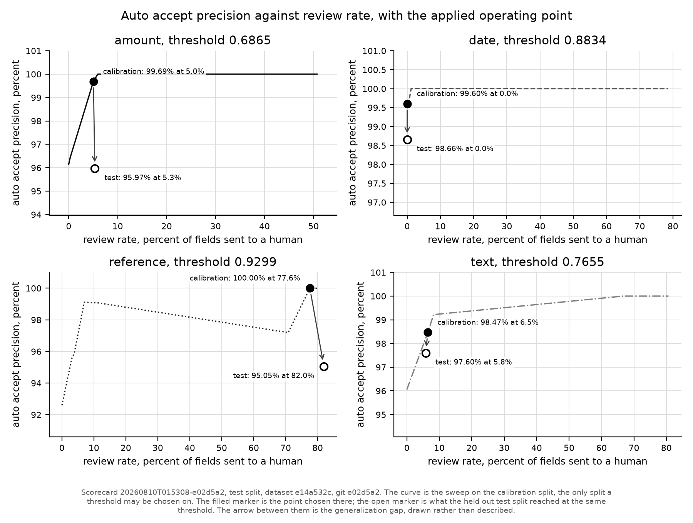
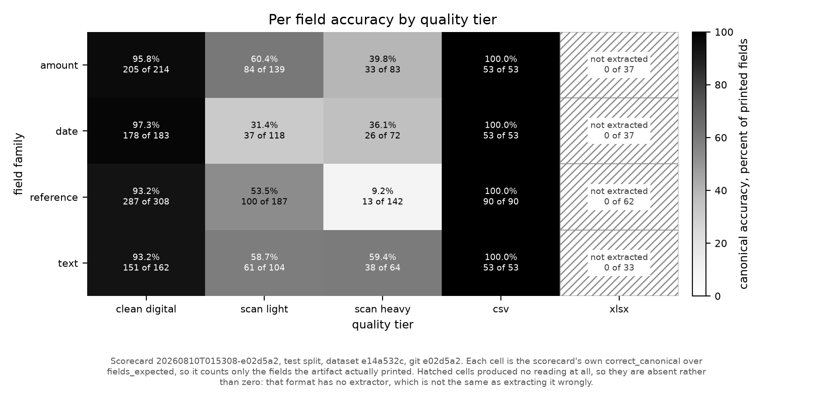
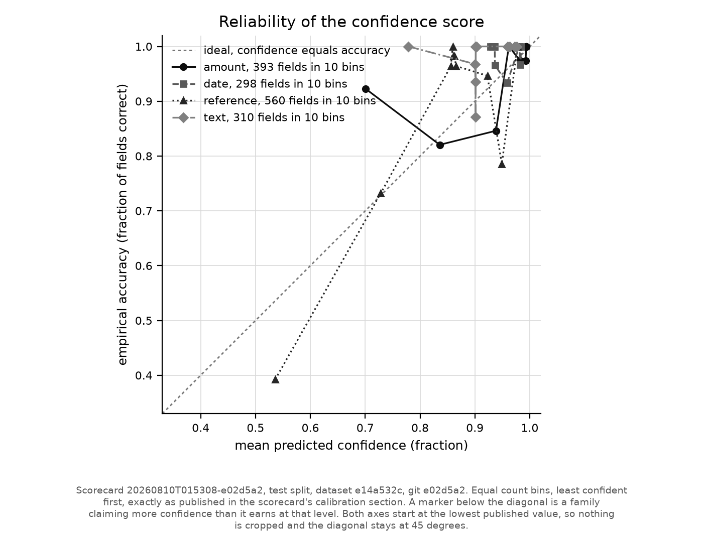
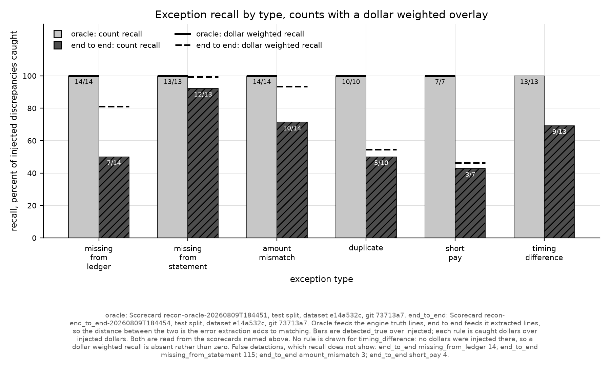

# Crossfoot

Crossfoot reads dealership statements, scores its own confidence on every field it
extracts, reconciles the result against the dealer ledger, and sends only the fields it
does not trust to a human.

Start with the worst number. On the held out test split, reference fields on the
`scan_heavy` tier come back **9.2 percent** correct, 13 of 142. Amounts on that tier are
39.8 percent, 33 of 83. That floor is not going to move much: a 17 character VIN on a
bad photocopy gives seventeen chances to read `0` as `O`.

The claim is not accuracy. The claim is that the system knows which fields to distrust.
Confidence is fit on the train split, thresholds are chosen on the calibration split, and
these are the numbers the held out test split produced at those thresholds:

| Held out test split | Value |
| --- | --- |
| Fields scored | 1561 |
| Auto accept precision | 97.08 percent |
| Review rate | 31.90 percent |
| Injected discrepancies caught, matching engine fed truth | 71 of 71, zero false detections |
| Injected discrepancies caught, matching engine fed extractions | 46 of 71, 136 false detections |

A reviewer looks at about one field in three. What they skip is 97 percent correct. The
last two rows are the same matcher over the same discrepancies, once on ground truth lines
and once on what the pipeline actually read, so the distance between them is extraction
error and nothing else.

An earlier version of this page published 98.02 percent at 16.02 percent review. That
number was partly bought with information no real document carries. Four confidence
features were read out of the dataset manifest rather than out of the artifact: the
generator's degradation tier, the true statement period, the true marque, and the true per
line type. Every one of them is now derived from the file and the extraction, or dropped.
The review rate roughly doubled and precision fell about a point. Those are the numbers the
method actually earns, and what each signal cost is below under "What the honest signals
cost".



Filled marker: the operating point chosen on the calibration split. Open marker: what the
held out test split reached at that same threshold. The arrow between them is the
generalization gap, drawn rather than described. Figure and numbers both come from
`scorecards/20260810T015308-e02d5a2/`.

## The problem

Every month an OEM sends each of its dealers a stack of statements: parts billing,
warranty credit memos, floorplan interest, incentive payments. Each one is a list of line
items the factory believes it owes or is owed. The dealership has its own ledger of what
it believes. Someone in the office reconciles the two by hand.

The documents arrive as clean PDFs, as photocopies of photocopies, as CSV exports with
whatever header names the export tool felt like, and as spreadsheets with merged title
cells. A missed short pay or a duplicated claim is real money, and the errors that matter
are the ones nobody has time to look for.

The interesting part is not reading the documents. It is knowing which readings to act on.

## What it does

```
gen -> extract -> confidence -> reconcile -> review
```

1. **Generate.** `crossfoot gen` builds the corpus: a ledger, statements composed from it,
   discrepancies injected into the statements, then rendering to PDF through Chromium,
   degradation to scans through Augraphy at 200 DPI, and messy CSV and XLSX exports. Every
   printed string is recorded, so ground truth is known by construction rather than
   labelled after the fact.
2. **Route and extract.** Documents are routed by file signature, never by the manifest,
   so a mislabelled artifact fails the way it would in production. Digital PDFs and CSVs
   go to deterministic extractors. Scanned PDFs are rasterized and sent to a vision model
   under a JSON schema, sampled twice per document (temperature 0, then temperature 0.4
   with the prompt field order shuffled) so per field agreement becomes a signal.
3. **Score confidence.** Each field gets a `FieldSignals` record: self consistency across
   the two samples, a VIN check digit validator, a date window read off the other dates the
   same extraction produced, a grammar match against the marque the document's own
   reference numbers vote for, whether the document's line amounts crossfoot to its printed
   total, a confusable glyph ratio over `{O0, I1l, S5, B8, Z2}`, and the route the router
   chose from the file's bytes. A logistic regression per field family, hand rolled in
   numpy, turns those into a probability. Every one of those is computable from the
   artifact alone; truth enters a fit only as the label on a row.
4. **Reconcile.** Three passes against the ledger: exact reference plus amount, exact
   reference with a differing amount, then a fuzzy pass scored on reference similarity,
   amount proximity, and date proximity. Unmatched lines and unconsumed ledger entries
   become typed exceptions with signed dollar impact.
5. **Review.** `crossfoot serve` builds a SQLite review database and serves a keyboard
   driven queue sorted by ascending confidence, with the cropped pixels the value came
   from next to it, plus an exceptions dashboard ranked by dollars. Corrections are append
   only: the original extraction stays recoverable as evidence and as a future eval label.

## Results

All figures below are the held out test split, from
`scorecards/20260810T015308-e02d5a2/scorecard.json` unless named otherwise.

### Per field accuracy by tier

Canonical accuracy, correct over the fields the artifact actually printed:

| Family | clean digital | scan light | scan heavy | csv | xlsx |
| --- | --- | --- | --- | --- | --- |
| amount | 95.8 (205/214) | 60.4 (84/139) | **39.8 (33/83)** | 100.0 (53/53) | not extracted (0/37) |
| date | 97.3 (178/183) | 31.4 (37/118) | 36.1 (26/72) | 100.0 (53/53) | not extracted (0/37) |
| reference | 93.2 (287/308) | 53.5 (100/187) | **9.2 (13/142)** | 100.0 (90/90) | not extracted (0/62) |
| text | 93.2 (151/162) | 58.7 (61/104) | 59.4 (38/64) | 100.0 (53/53) | not extracted (0/33) |



The saved extractions this scorecard reads predate the XLSX extractor, so nothing read
those 169 printed fields. They are drawn hatched and labelled absent rather than zero,
because "no extractor ran on this format" is a different fact from "read it and got it
wrong". They still count against the totals.

Most of the scanned tier loss is fields the model never returned at all, not fields it
returned wrong. Splitting the two:

| Family and tier | Returned, percent of printed | Correct, percent of returned |
| --- | --- | --- |
| amount, scan light | 60.4 (84/139) | 100.0 (84/84) |
| amount, scan heavy | 60.2 (50/83) | 66.0 (33/50) |
| date, scan light | 31.4 (37/118) | 100.0 (37/37) |
| date, scan heavy | 40.3 (29/72) | 89.7 (26/29) |
| reference, scan light | 56.7 (106/187) | 94.3 (100/106) |
| reference, scan heavy | 47.9 (68/142) | 19.1 (13/68) |
| text, scan light | 58.7 (61/104) | 100.0 (61/61) |
| text, scan heavy | 59.4 (38/64) | 100.0 (38/38) |

Reference on heavy scans is the one cell where the model reads confidently and reads
wrong: 68 of 142 references returned, 13 of them right. That is the VIN transcription
problem, and it is exactly the cell the confidence model has to catch. Across the whole
test split the extractor produced zero spurious fields, meaning zero values that resolve
to no truth field at all.

### Confidence: what was promised, what held

Per family, the operating point chosen on the calibration split and what the held out test
split reached at that same threshold. Both points are in the committed sweep.

| Family | Threshold | Calibration precision | Calibration review rate | Test precision | Test review rate |
| --- | --- | --- | --- | --- | --- |
| amount | 0.6865 | 99.69 | 5.04 | 95.97 | 5.34 |
| date | 0.8834 | 99.60 | 0.00 | 98.66 | 0.00 |
| reference | 0.9299 | 100.00 | 77.57 | 95.05 | 81.96 |
| text | 0.7655 | 98.47 | 6.45 | 97.60 | 5.81 |

Every family lost precision on held out data, which is what a promise chosen on one split
does when it meets another. Reference now reviews four fields in five and still only
reaches 95.05 percent on what it accepts. It is the family carrying the heavy scan VINs,
where 68 of 142 references come back and 13 of those are right, so a model that cannot
separate them has little left to do but send nearly all of them to a human.

Amount is the family that over promises hardest: 99.69 percent on calibration against
95.97 percent on test, at a review rate near 5 percent either way. What it lost was a sign
check against the line type, and no extractor produces a line type, so for a single amount
what remains is whether the text parsed. The arithmetic standing in for it is the document
level crossfoot and the residual suspect flag beside it.

Date auto accepts everything at both points. Its threshold sits below the confidence of
every date field, which is the model saying it has no date it distrusts. On a test split
where only 31.4 percent of scan light dates are read correctly, that is worth reading as a
weakness of the date signals rather than a strength.

### What the honest signals cost

`SignalContext` used to be handed a `ManifestRecord`. Four of the values it took from there
have no inference time equivalent, and `src/crossfoot/scoring.py`, which materializes the
review database the API and the UI read, took the same route. What replaced each:

| Signal | Was | Is |
| --- | --- | --- |
| categorical base rate | the generator's `quality_tier`, one hot encoded | `ExtractionRoute`, read off the file's bytes by the router |
| date window | the true `period_start` and `period_end` | the statement date this extraction produced, or the middle of the document's other dates, and never a date's own |
| amount validator | parsed, and the sign agreed with the true line type | parsed |
| reference grammar | the true `oem`'s grammar | the marque this document's own reference numbers vote for, falling back to whether any marque recognizes the value |

Measured by refitting on train, rechoosing thresholds on calibration and rescoring test
each time, the tier label alone was worth about 16 percentage points of review rate:
merging `scan_light` and `scan_heavy` into one scanned value cost 4 points, and removing
tier information entirely cost 37. The route lands between them, because a document does
announce whether it carries a text layer and does not announce how badly it was
photocopied.

`tests/unit/test_truth_boundary.py` walks the AST of every module under `src/crossfoot`
except the generator, the eval harness and the manifest model itself, and fails the build
if any of them imports the manifest or mentions `manifest.json`. It also pins the field
lists of `FieldSignals` and `SignalContext`, because an import guard alone would not catch
the leak coming back as a new field.



Expected calibration error on test, computed from the committed calibration bins with
`expected_calibration_error` in `src/crossfoot/confidence/calibration.py`: amount 0.042,
date 0.044, reference 0.094, text 0.068. The contract sets a ceiling of 0.05 and calls for
Platt scaling fit on the calibration split above it. Reference and text are over the
ceiling and the remedy has not been applied yet. See Limitations.

### Reconciliation: how much of the error is extraction

The matching engine runs in two modes over the same code. Oracle mode feeds it ground
truth statement lines. End to end mode feeds it extracted lines. The distance between them
is the error extraction adds to matching.

| Exception type | Oracle caught | End to end caught | End to end false detections |
| --- | --- | --- | --- |
| missing from ledger | 14/14 | 7/14 | 14 |
| missing from statement | 13/13 | 12/13 | 115 |
| amount mismatch | 14/14 | 10/14 | 3 |
| duplicate | 10/10 | 5/10 | 0 |
| short pay | 7/7 | 3/7 | 4 |
| timing difference | 13/13 | 9/13 | 0 |
| **total** | **71/71, zero false** | **46/71 (64.8 percent)** | **136** |

Sources: `scorecards/recon-oracle-20260809T184451/scorecard.json` and
`scorecards/recon-end_to_end-20260809T184454/scorecard.json`, same dataset hash, same test
split, same commit. By dollars, end to end recovers 283,150.45 of 367,465.71 injected, or
77.1 percent, because the largest discrepancies sit on lines that were read correctly.



The 136 false detections are the real finding here, and 115 of them are one failure mode:
when extraction misses a statement line, the ledger entry it should have matched looks
unclaimed, and the engine reports it as missing from the statement. Recall degrades
gracefully under extraction error; precision does not.

Oracle mode is not vacuously perfect. An earlier committed oracle run over the train
split, `scorecards/recon-oracle-20260809T090106/scorecard.json` at commit `433d01a`,
caught 137 of 141 with 4 false detections.

### Cost

Actual spend on the published run was zero. The vision path was served by a local model
through an OpenAI compatible gateway, so the tokens cost electricity, not money.

Reporting zero would make a local run look free rather than cheap, so the price table in
`src/crossfoot/constants.py` carries an explicit **equivalence**: what the same tokens
would list for at a comparable hosted vision model. Under that equivalence the cost ledger
for the whole corpus, all three splits, totals 0.1678 USD across the 185 documents that
were processed, about **0.00091 USD per document**. Of that, 0.0614 USD is cloud traffic
priced at a real list rate and the rest is the local model priced as if it were hosted.
The prices themselves are marked `# unverified` in the table until confirmed against each
provider's public page.

This is the one number on this page that is not in a committed scorecard. `crossfoot eval`
does not populate the scorecard's `costs` section yet, so every committed scorecard has
`"costs": []`, and the figure above comes from the run's own cost ledger under `data/`,
which is not committed. Treat it accordingly.

## Why the numbers are worth anything

**Ground truth by construction.** Nothing is hand labelled. The generator composes each
statement from a ledger it also writes, injects discrepancies it records, and the renderer
captures every string it prints into `rendered_values`. Truth is what was printed, known
before any extractor sees the file.

**A field counts as expected only if the artifact printed it.** CSV exports carry no
statement totals; XLSX exports carry only some header fields. Counting those against the
extractor measured the format, not the pipeline. So the scorecard publishes both
denominators side by side, `fields_in_truth` and `fields_expected`, and a reader can judge
the change instead of taking it on trust. On this test split they are 2227 and 2194.

**Document level splits, and the discipline is code.** Splits are assigned per document,
stratified by document type and quality tier, 50/25/25 across 105 train, 52 calibration,
and 53 test documents, so no field from one statement can appear on both sides of a split.
`fit_scorers` refuses any split but train and `choose_thresholds` refuses any split but
calibration, both checking the caller's stated intent and the split tag on every row.
Misuse raises `SplitDisciplineError` rather than quietly inflating a scorecard.
`sweep_point`, which measures a threshold already chosen, is deliberately not guarded and
carries a docstring saying why.

**Nothing that scores a document can see the answers.** One test walks the AST of every
module under `src/crossfoot` and fails if any of them imports the generator or the manifest
models, or mentions `manifest.json`. Five modules are exempt and each is named with its
reason: the generator writes the answer key, the eval harness scores against it, the
manifest model is it, and `ingest_db.py` and `cli.py` are the dataset commands. An earlier
version named three packages instead, which left `scoring.py` outside the net and let the
manifest reach the review database; that is the leak this build closed.

**Scorecards are committed with their git sha.** Each carries `run_id`, `git_sha`,
`dataset_config_hash`, `master_seed`, and the split it reports. The dataset hash on all
three test split scorecards here is `e14a532c` and the seed is 42, so anyone can
regenerate the corpus and confirm they are reading numbers about the same 220 files. The
field scorecard was rerun at commit `9a75185`, the commit that rebuilt the confidence
signals, so its `git_sha` names code that reproduces it. The two reconciliation scorecards
are unchanged from `73713a7`, because reconciliation never read the signals that moved.

**Figures live next to the scorecard that produced them.** `crossfoot plots` writes each
PNG into the scorecard's own directory and stamps the run id, split, dataset hash, and git
sha into the caption. A figure cannot drift from its numbers because it has nowhere else
to live.

## Reproduce it

Requires Python 3.12 and [uv](https://docs.astral.sh/uv/).

```bash
just setup                  # uv sync, pre-commit hooks, playwright chromium
just                        # ruff, mypy strict, pytest
```

Build the corpus and score the deterministic tiers. This much needs no API key and no GPU:

```bash
uv run crossfoot gen --seed 42 --out data/dataset
uv run crossfoot eval --dataset data/dataset --split test
uv run crossfoot reconcile --dataset data/dataset --split test --mode oracle
```

`gen` renders through Playwright Chromium and degrades scans through Augraphy, so it is
the slow step. The same seed produces byte identical output, asserted by
`tests/contract/test_generator_determinism.py`.

The scanned tier needs a vision model that also supports `json_schema` response formats.
Point `CROSSFOOT_LLM_BASE_URL` at any OpenAI compatible endpoint, local or hosted, or set
a provider key from `.env.example`:

```bash
uv run crossfoot probe                                              # what is reachable
uv run crossfoot extract --dataset data/dataset --split train --mode live
uv run crossfoot extract --dataset data/dataset --split calibration --mode live
uv run crossfoot extract --dataset data/dataset --split test --mode live --resume
uv run crossfoot calibrate --dataset data/dataset                   # fit, then choose
uv run crossfoot eval --dataset data/dataset --split test           # scores the saved run
uv run crossfoot reconcile --dataset data/dataset --split test --mode end_to_end
uv run crossfoot plots
```

Then the review surface:

```bash
cd frontend && npm install && npm run build && cd ..
uv run crossfoot serve --dataset data/dataset
```

Honest scope. `crossfoot eval` scores the saved extractions from `crossfoot extract` when
they exist and falls back to the offline routes when they do not, so running it on a fresh
checkout scores CSV and digital PDF only and every scanned document reads as zero. The
published scanned tier numbers came from one specific local vision model; a different
model gives different numbers, and reproducing this table exactly means reproducing that
choice. `data/` is not committed, so the corpus, the extractions, and the ledgers are
rebuilt locally rather than downloaded.

## Design notes worth defending

**The provider was chosen by probing, not by a leaderboard.** Every candidate got one
direct call carrying an image and a `json_schema` response format, against its own default
model. The capability matrix in `docs/contracts-phase2.md` is the result, and it is a
matrix of what each provider would actually do rather than what a benchmark says it can.
Groq answered that content must be a string and that it does not support the
`json_schema` response format, so it is text only. Before that was known, a capability
blind spillover chain with Groq sitting second lost 36 of 105 documents in one run: a 400
is correctly classified as fatal, so those documents neither retried nor spilled over. The
vision pool is now capability filtered where it is constructed. The published run ended up
served mostly by a local model, not because local is fashionable, but because free tier
daily quota ran out partway through a 220 document corpus, and a run that cannot finish is
not a run.

**With structured outputs, the schema is the specification, so do not restate it.** The
extraction prompt is one sentence: extract every field and every line item from this
document type. An earlier version described the shape in prose and listed the field names.
The smaller vision model then returned a schema valid response with an empty line array on
every scanned document, which read as an accuracy collapse rather than the prompt fault it
was. Naming internal field names (`vin`, `line_amount`) sent it hunting for column headers
the page never prints and it answered with correctly shaped rows whose every value was
null: invalid output on two document types and all null rows on a third. The reasoning is
kept in the docstring of `_user_prompt` in `src/crossfoot/extraction/llm_vision.py` so
nobody helpfully adds the detail back.

**Oracle mode is a reporting requirement, not a debugging convenience.** Running the
matching engine over ground truth lines and over extracted lines gives two numbers whose
difference is attributable. Without it, "we caught 65 percent of discrepancies" is one
number that could mean a weak matcher or a weak reader, and the fix for those is not the
same fix. `reconcile()` takes a `StatementDoc` in both modes so it is provably the same
code path.

**Correctness never depends on model reported coordinates.** Review crops come from
pdfplumber word boxes on the deterministic path, and from row stripes detected by a
horizontal projection profile on the vision path. A model supplied bounding box only
refines a band it already agrees with, and is discarded silently when it fails a sanity
check. Bounding boxes are never scored.

## Limitations

**The documents are synthetic.** These are generated statements: realistic in format,
built from four fictional marques, with the paperwork conventions of real OEM statements
but none of their content. No real dealership has run this and no real statement has been
through it. Every number on this page describes how the pipeline performs on the
generator's world. Real scans are dirtier in ways a generator does not know to imitate,
real chart of accounts data is messier than a synthesized ledger, and the discrepancy mix
here is one a script chose. Treat the numbers as a measurement of the method, not a
forecast of production accuracy.

**No XLSX extractor in the published run.** The extractor exists, but the saved
extractions this scorecard was computed from predate it, so 169 printed fields on the test
split score zero in `scorecards/20260810T015308-e02d5a2/scorecard.json`. Four of the 53
test documents are XLSX, which is most of why that run served 47 of them. The tables above
will only change when a new scorecard is committed to change them.

**Two families are miscalibrated on test.** Reference at 0.094 and text at 0.068 expected
calibration error both exceed the 0.05 ceiling the contract sets. Platt scaling fit on the
calibration split is specified as the remedy and has not been applied, so the confidence
numbers those two families report are, at the moment, more confident than they have
earned. Amount and date are inside the ceiling.

**End to end reconciliation precision is poor.** 136 false detections against 46 true. A
reviewer working that queue by dollar rank would still find real money first, but the
queue is mostly noise, and the noise is a downstream symptom of missed extractions rather
than a matching bug.

**The operating point does not transfer evenly.** Amount promised 99.69 percent precision
on calibration and delivered 95.97 percent on held out data at the same review rate.
Reference promised 77.57 percent review and delivered 81.96 percent. Thresholds chosen on
52 calibration documents are a small sample doing a load bearing job.

**The reference operating point is barely an operating point.** Sending four fields in
five to a human is not automation, and the family still misses one accepted field in
twenty. What would fix it is a per character transcription confidence from the vision
model, which the current response schema does not ask for.

**Cost is not in a committed scorecard,** the price table entries are marked unverified,
and the local model's price is an equivalence rather than a measurement.

**Single operator tool.** No authentication, no multi tenancy, and the review database is
rebuilt from the dataset rather than migrated.

## License

Apache-2.0
