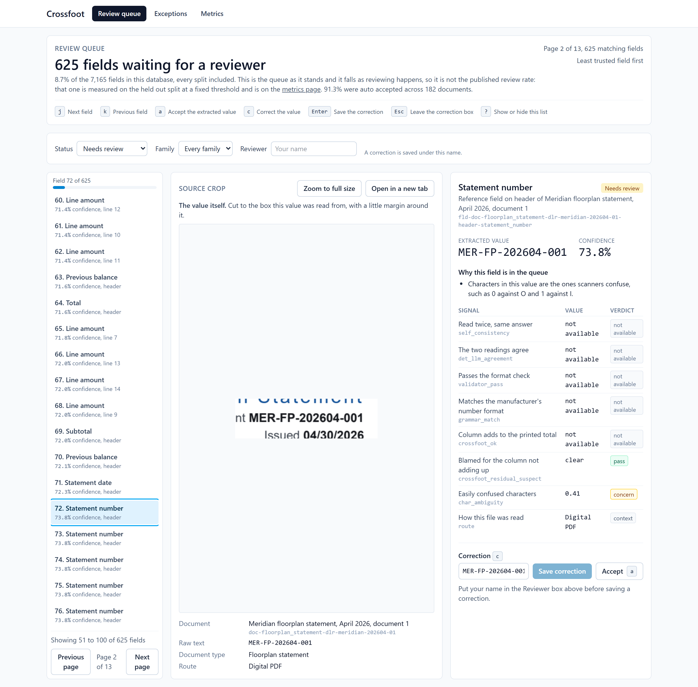
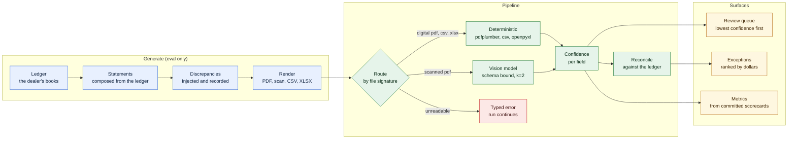
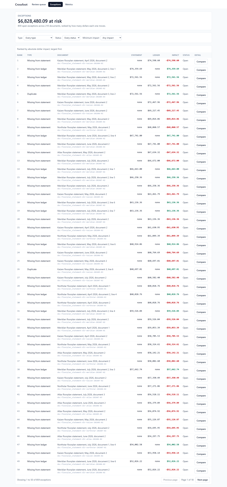
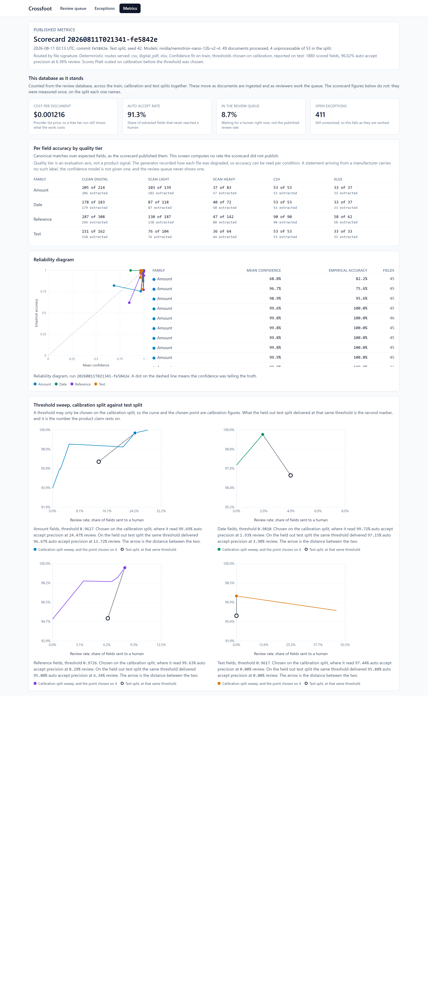
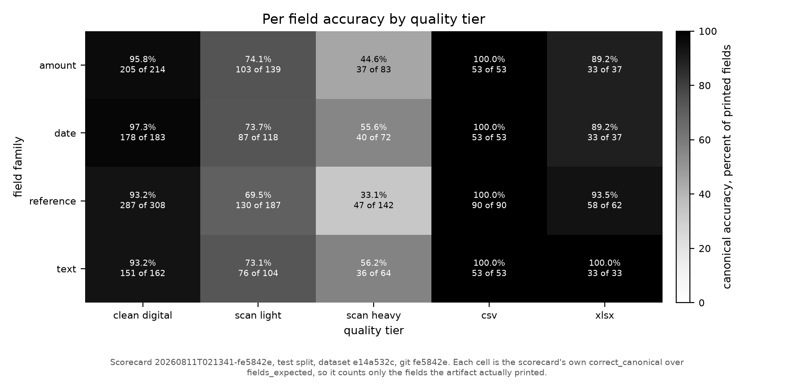
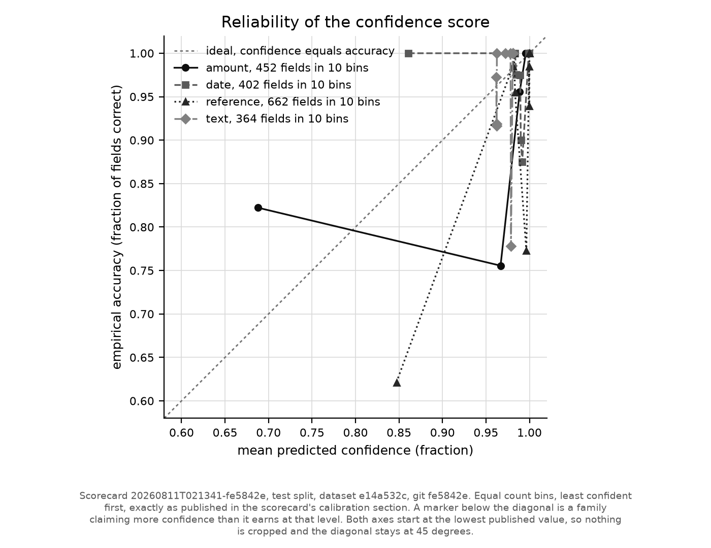
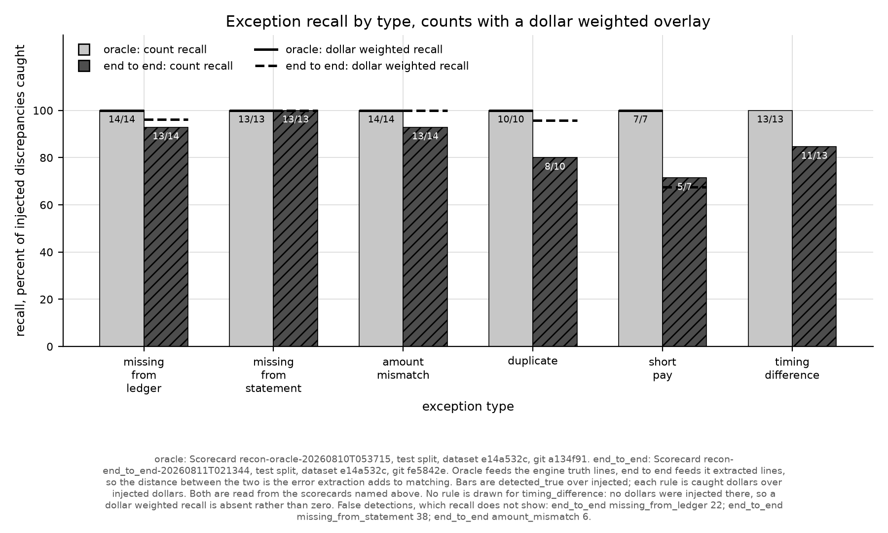

# Crossfoot

Crossfoot reads dealership statements, scores its own confidence on every field it
extracts, reconciles the result against the dealer ledger, and sends only the fields it
does not trust to a human.



A reviewer sees the least trusted reading first, next to the pixels it came from, with the
reason it was flagged. On the held out test split that is **6.38 percent of fields**, and
what the queue skips is **96.02 percent** correct.

| Held out test split | Value |
| --- | --- |
| Auto accept precision | 96.02 percent |
| Review rate | 6.38 percent |
| Worst cell, references on heavy photocopies | 33.1 percent correct |
| Discrepancies caught, matcher fed extractions | 63 of 71, 66 false detections |
| Discrepancies caught, matcher fed truth | 71 of 71, zero false |
| Cost per processed document | 0.0012 USD |

Numbers come from `scorecards/20260811T021341-fe5842e/`, committed with the git sha that
produced them. Confidence is fit on train, thresholds are chosen on calibration, and every
figure above is measured on a test split that neither of those touched.

## How it works



The generator exists only to make the eval honest: every printed string is recorded as it
is rendered, so ground truth is known by construction and nobody labelled anything
afterwards. The pipeline never reads that record. It routes on the file's own bytes, the
way it would in production.

## Correcting a field moves the money



Reconciliation output, ranked by absolute dollar impact, each row expanding to the
statement line beside the ledger entry it disagrees with. Correcting a field in the queue
re-reconciles that document and tells the reviewer what it changed: **cleared 1 exception,
1,840.00 dollars less at risk on this statement**. The original extraction is kept as
evidence, so a correction is an append, never an overwrite.

## The numbers are published, not asserted



Every figure on that page is read from a committed scorecard, and each one names the split
it came from. Live database counts sit in their own section because they move as reviewers
work, and a number that moves must not sit beside one that does not.

[docs/walkthrough.md](docs/walkthrough.md) walks one document through the whole system with
sequence and state diagrams.

## The problem

Every month an OEM sends each of its dealers a stack of statements: parts billing,
warranty credit memos, floorplan interest, incentive payments. Each one is a list of line
items the factory believes it owes or is owed. The dealership has its own ledger of what
it believes. Someone in the office reconciles the two by hand.

The documents arrive as clean PDFs, as photocopies of photocopies, as CSV exports with
whatever header names the export tool felt like, and as spreadsheets with merged title
cells. A missed short pay or a duplicated claim is real money, and the errors that matter
are the ones nobody has time to look for.

The interesting part is not reading the documents. It is knowing which readings to act on.

## What it does

1. **Generate.** `crossfoot gen` builds the corpus: a ledger, statements composed from it,
   discrepancies injected into the statements, rendering to PDF through Chromium,
   degradation to scans through Augraphy, and messy CSV and XLSX exports.
2. **Route and extract.** Documents are routed by file signature, never by the manifest, so
   a mislabelled artifact fails the way it would in production. Digital PDFs, CSVs and XLSX
   go to deterministic extractors. Scanned PDFs are rasterized and sent to a vision model
   bound to a per document type schema, sampled twice so per field agreement is a signal.
3. **Score confidence.** Each field gets a `FieldSignals` record: self consistency across
   the two samples, a VIN check digit, a date window read off the extraction's own dates, a
   grammar match against the marque its reference numbers vote for, whether the line amounts
   crossfoot to the printed total, a confusable glyph ratio, and the route. A per family
   logistic regression, hand rolled in numpy, turns those into a probability.
4. **Reconcile.** Three passes against the ledger: exact reference plus amount, exact
   reference with a differing amount, then a fuzzy pass on reference, amount and date
   proximity. What is left over becomes typed exceptions carrying signed dollar impact.
5. **Review.** `crossfoot serve` builds a SQLite review database and serves the three
   screens above.

## Results

All figures below are the held out test split, from
`scorecards/20260811T021341-fe5842e/scorecard.json` unless named otherwise.

### Per field accuracy by tier

Canonical accuracy, correct over the fields the artifact actually printed:

| Family | clean digital | scan light | scan heavy | csv | xlsx |
| --- | --- | --- | --- | --- | --- |
| amount | 95.8 (205/214) | 74.1 (103/139) | 44.6 (37/83) | 100.0 (53/53) | 89.2 (33/37) |
| date | 97.3 (178/183) | 73.7 (87/118) | 55.6 (40/72) | 100.0 (53/53) | 89.2 (33/37) |
| reference | 93.2 (287/308) | 69.5 (130/187) | **33.1 (47/142)** | 100.0 (90/90) | 93.5 (58/62) |
| text | 93.2 (151/162) | 73.1 (76/104) | 56.2 (36/64) | 100.0 (53/53) | 100.0 (33/33) |



Most of the scanned tier loss is fields the model never returned at all, not fields it
returned wrong. That distinction matters more than it looks, because auto accept precision
counts only what came back. Splitting the two:

| Family and tier | Returned, percent of printed | Correct, percent of returned |
| --- | --- | --- |
| amount, scan light | 74.1 (103/139) | 100.0 (103/103) |
| amount, scan heavy | 68.7 (57/83) | 64.9 (37/57) |
| date, scan light | 73.7 (87/118) | 100.0 (87/87) |
| date, scan heavy | 69.4 (50/72) | 80.0 (40/50) |
| reference, scan light | 73.8 (138/187) | 94.2 (130/138) |
| reference, scan heavy | 56.3 (80/142) | 58.8 (47/80) |
| text, scan light | 73.1 (76/104) | 100.0 (76/76) |
| text, scan heavy | 68.8 (44/64) | 81.8 (36/44) |

So when the confidence section below reports 97.15 percent precision on dates while this
table reports 73.7 percent accuracy on light scan dates, both are true and the denominators
differ: the model returned 87 of 118 dates and every one of them was right. It abstains
rather than guesses. That is defensible behaviour and it is not visible in a precision
number, which is why both tables are here.

Reference on heavy scans is still the cell where the model reads confidently and reads
wrong: 80 of 142 references returned, 47 of them right. That is the VIN transcription
problem, and it is exactly the cell the confidence model has to catch. Across the whole
test split the extractor produced 14 spurious fields, values that resolve to no truth field
at all, out of 1880 extracted.

### Confidence: what was promised, what held

Per family, the operating point chosen on the calibration split and what the held out test
split reached at that same threshold. Both points are in the committed sweep.

| Family | Threshold | Calibration precision | Calibration review rate | Test precision | Test review rate |
| --- | --- | --- | --- | --- | --- |
| amount | 0.9627 | 99.69 | 24.47 | 96.67 | 13.72 |
| date | 0.9810 | 99.72 | 1.93 | 97.15 | 3.98 |
| reference | 0.9726 | 99.63 | 8.29 | 95.00 | 6.34 |
| text | 0.9617 | 97.44 | 0.00 | 95.88 | 0.00 |

Every family lost precision on held out data, and every family missed the precision target
its threshold was chosen to hit. The targets are 99.5 percent for amounts and references,
99 percent for dates, 97 percent for text. On test they delivered 96.67, 95.00, 97.15 and
95.88. A threshold chosen to a target on one split does not carry that target to another,
and 52 calibration documents are a small sample doing a load bearing job.

Reference used to carry almost the whole review burden, at 64.60 percent on calibration,
because the reader it was scoring got 9.2 percent of heavy scan references right and no
scorer can separate readings that are nearly all wrong. It now reviews 6.34 percent. That
change came from replacing the model, not from touching the confidence code, which is the
most useful thing this project measured: the scorer is only as good as the spread it is
given, and a reader that is wrong almost everywhere leaves no spread to find.

Amount is now the family reviewing most, 13.72 percent. What it lost when the manifest
features were removed was a sign check against the line type, and no extractor produces a
line type, so for a single amount what remains is whether the text parsed. The arithmetic
standing in for it is the document level crossfoot and the residual suspect flag beside it.

Text still auto accepts everything. Its threshold sits below the confidence of every field
in the family, which is the model saying it distrusts none of them, so its 95.88 percent is
earned by the reader abstaining on hard pages rather than by the scorer catching anything.

### What the honest signals cost

`SignalContext` used to be handed a `ManifestRecord`. Four of the values it took from there
have no inference time equivalent, which means an earlier version of this page published
numbers partly bought with information no real document carries. What replaced each:

| Signal | Was | Is |
| --- | --- | --- |
| categorical base rate | the generator's `quality_tier`, one hot encoded | `ExtractionRoute`, read off the file's bytes by the router |
| date window | the true `period_start` and `period_end` | the statement date this extraction produced, or the middle of the document's other dates, and never a date's own |
| amount validator | parsed, and the sign agreed with the true line type | parsed |
| reference grammar | the true `oem`'s grammar | the marque this document's own reference numbers vote for |

The tier label alone was worth roughly 16 percentage points of review rate when it was
removed, measured by refitting and rescoring each time. The route lands well below it,
because a file announces whether it carries a text layer and does not announce how badly it
was photocopied. Those figures were measured on the earlier corpus and no committed
scorecard carries them, so read them as the shape of the effect rather than as current
numbers.



Expected calibration error on test: amount 0.039, date 0.042, reference 0.058, text 0.044.
The contract sets a ceiling of 0.05 and specifies Platt scaling above it, which this run
applies; the scorecard carries the slope and intercept per family in `platt_scaling`, so a
published figure is rebuildable from the committed file. Reference is still over at 0.058.
Platt is monotonic, so it corrects how honest a probability is and cannot change which
fields the queue holds.

### Reconciliation: how much of the error is extraction

The matching engine runs in two modes over the same code. Oracle mode feeds it ground
truth statement lines. End to end mode feeds it extracted lines. The distance between them
is the error extraction adds to matching.

| Exception type | Oracle caught | End to end caught | End to end false detections |
| --- | --- | --- | --- |
| missing from ledger | 14/14 | 13/14 | 22 |
| missing from statement | 13/13 | 13/13 | 38 |
| amount mismatch | 14/14 | 13/14 | 6 |
| duplicate | 10/10 | 8/10 | 0 |
| short pay | 7/7 | 5/7 | 0 |
| timing difference | 13/13 | 11/13 | 0 |
| **total** | **71/71, zero false** | **63/71 (88.7 percent)** | **66** |

Sources: `scorecards/recon-oracle-20260811T021348/scorecard.json` and
`scorecards/recon-end_to_end-20260811T021344/scorecard.json`, same dataset hash, same test
split, same commit. By dollars, end to end recovers 356,934.28 of 367,465.71 injected, or
97.1 percent, because the largest discrepancies sit on lines that were read correctly.



The 66 false detections are the remaining weakness, and most are one failure mode: when
extraction misses a statement line, the ledger entry it should have matched looks
unclaimed, and the engine reports it as missing from the statement. Recall degrades
gracefully under extraction error; precision does not.

Both halves moved together when the vision model changed, which is the point. Caught rose
from 51 to 63 and false detections fell from 150 to 66, because a line that is read is a
line that cannot be reported missing. Reconciliation precision was never a matching problem
to solve on its own.

Oracle mode is not vacuously perfect. An earlier committed oracle run over the train
split, `scorecards/recon-oracle-20260809T090106/scorecard.json` at commit `433d01a`,
caught 137 of 141 with 4 false detections.

### Cost

The published run made 237 vision calls over 84 documents, all served by
`nvidia/nemotron-nano-12b-v2-vl`. Priced at the list rate in `src/crossfoot/constants.py`,
the whole corpus across all three splits comes to 0.2214 USD, about **0.00122 USD per
processed document**, which is the figure the review surface shows.

The denominator is the 182 documents that produced fields, not all 210: an unreadable file
costs nothing to extract and would flatter the number by sitting in it. Of those 182, only
the scanned ones reach a model, so a document that costs anything costs about 0.0026 USD.
The other 126 are read by pdfplumber, the csv reader, or openpyxl and never touch a
provider at all, which is the whole point of routing by file signature first.

A run id names a split and a dataset rather than one invocation, so the ledger also holds
calls from attempts whose output was discarded. It is append only and keeps them, because
what was spent is not editable by whether the output was kept. The figures above are scoped
to the attempt that produced the committed extractions, which is the same scoping the
scorecard uses to name its models.

This is the one number on this page that is not in a committed scorecard. `crossfoot eval`
does not populate the scorecard's `costs` section yet, so every committed scorecard has
`"costs": []`, and the figure above comes from the run's own cost ledger under `data/`,
which is not committed. Treat it accordingly.

## Why the numbers are worth anything

**Ground truth by construction.** Nothing is hand labelled. The generator composes each
statement from a ledger it also writes, injects discrepancies it records, and the renderer
captures every printed string. Truth is what was printed, known before any extractor sees
the file.

**A field counts as expected only if the artifact printed it.** CSV exports carry no
statement totals and XLSX exports carry only some header fields, so counting those against
the extractor would measure the format rather than the pipeline. The scorecard publishes
both denominators, `fields_in_truth` and `fields_expected`, at 2227 and 2194 here.

**Split discipline is code, not convention.** Splits are per document, stratified by type
and tier, 105 train, 52 calibration, 53 test. `fit_scorers` refuses any split but train and
`choose_thresholds` refuses any split but calibration, both checking the split tag on every
row rather than the caller's word for it. Misuse raises `SplitDisciplineError` instead of
quietly inflating a scorecard.

**Nothing that scores a document can see the answers.** A test walks the AST of every
module under `src/crossfoot` and fails if any imports the generator or the manifest. The
exemption is by directory, so it catches the accidental leak rather than a determined one,
and it caught a real one: an earlier build left `scoring.py` outside the net and the
manifest reached the review database. The stronger half pins the exact field lists of
`FieldSignals` by set equality, so a leak arriving as a new signal fails even when the
import graph looks clean.

**Scorecards carry their git sha, dataset hash and seed.** A corpus regenerated from seed
42 matches this one byte for byte, every file and every tier, so the dataset a reader
builds is the dataset these numbers were measured on. `just repro` checks it cell by cell
for the tiers that need no model. Each scorecard also names every model that served the
run, because which model reads a scanned page matters more than anything else here.

**Figures live beside the scorecard that produced them.** `crossfoot plots` writes each PNG
into that scorecard's own directory, so a figure cannot drift from its numbers.

## Reproduce it

Requires Python 3.12 and [uv](https://docs.astral.sh/uv/).

```bash
just setup     # uv sync, pre-commit hooks, playwright chromium
just           # ruff, mypy strict, pytest, frontend tests
just repro     # regenerate the corpus and check it against the committed scorecard
```

`just repro` rebuilds the corpus from seed 42 into its own directory, scores the
deterministic tiers, and compares 12 cells with the committed scorecard. It should report
0 differences. It deliberately skips the two scanned tiers and says so rather than passing
quietly, because those need a vision model.

To run the product rather than the eval:

```bash
uv run crossfoot gen --seed 42 --out data/dataset
uv run crossfoot extract --dataset data/dataset --split test --mode replay
cd frontend && npm install && npm run build && cd ..
uv run crossfoot serve --dataset data/dataset
```

The extract step needs no key and will report failures, which is expected. Replay serves
the vision path from committed cassettes and there are none for this corpus, so the
deterministic tiers come through and the scanned documents do not. It is enough for all
three screens and the correction loop to work end to end.

For the scanned tier, point `CROSSFOOT_LLM_BASE_URL` at any OpenAI compatible endpoint and
add a key from `.env.example`:

```bash
uv run crossfoot probe                                     # what is reachable
uv run crossfoot extract --dataset data/dataset --split train --mode live
uv run crossfoot extract --dataset data/dataset --split calibration --mode live
uv run crossfoot extract --dataset data/dataset --split test --mode live --resume
uv run crossfoot calibrate --dataset data/dataset          # fit, then choose
uv run crossfoot eval --dataset data/dataset --split test --calibrate
uv run crossfoot reconcile --dataset data/dataset --split test --mode end_to_end
uv run crossfoot plots
```

**Honest scope.** `data/` is not committed, so the corpus, the extractions and the ledgers
are rebuilt locally. The scanned tier numbers depend on which model read the page, more
than on anything else here, so reproducing that column means using the model the scorecard
names.

**The corpus is byte reproducible, and that took a fix worth naming.** Augraphy's
`DirtyRollers` calls `random.randint` from inside a numba compiled function, and numba
implements the `random` module in nopython mode with its own generator state, which seeding
the interpreter cannot reach. Only a seed call made from inside compiled code does. That
augmentation is picked on a coin flip, which is why exactly 17 of the 32 `scan_heavy`
documents used to differ rather than all of them.

## Design notes worth defending

**Which model reads the page is the largest lever in this pipeline, by a distance.** On the
same heavy photocopies, a small local model read 1 percent of reference fields correctly
and the hosted model read 87 percent in a bake off. Everything downstream followed: the
reference review rate fell from 64.6 percent to 6.3 percent without a line of the
confidence code changing, because a scorer can only separate readings that differ in
quality, and a reader that is wrong almost everywhere leaves nothing to separate. Before
that was measured, the obvious fix looked like re reading failing fields at higher
resolution. It was built, measured, and recovered nothing.

**Distrust the word "unprocessable".** 26 of 210 documents were being dropped before they
were scored, each for a different reason wearing the same label: a stale router verdict
from a build that predated the XLSX extractor, answers truncated at exactly 4096 tokens by
a serving context window, and one document lost to a provider timeout and simply absent
from the denominator. That last one is the failure worth fearing, because the scorecard
still looked healthy. "The model cannot read this" is a conclusion that several
infrastructure faults will happily impersonate, and each shows up as an accuracy number
rather than as an error.

**Providers were chosen by probing, not by a leaderboard.** Every candidate got one direct
call carrying an image and a `json_schema` response format. Groq answered that content must
be a string and that it does not support the format, so it is text only; before that was
known, a capability blind spillover chain with Groq second lost 36 of 105 documents in one
run, because a 400 neither retries nor spills over. NVIDIA NIM advertises the format, serves
a two field schema, then returns 500 on the frozen document schema six times out of six, so
the schema travels in the message instead and the reply is validated here either way. A
capability list would have missed both.

**With structured outputs, the schema is the specification, so do not restate it.** The
prompt is one sentence. An earlier version described the shape in prose and named internal
fields like `vin` and `line_amount`, which sent the model hunting for column headers the
page never prints; it answered with correctly shaped rows whose every value was null. That
reasoning lives in the docstring of `_user_prompt` so nobody helpfully adds the detail back.

**Oracle mode is a reporting requirement, not a debugging convenience.** Running the matcher
over ground truth lines and over extracted lines gives two numbers whose difference is
attributable. Without it, "we caught 65 percent" could mean a weak matcher or a weak reader,
and those need different fixes. `reconcile()` takes a `StatementDoc` in both modes so it is
provably the same code path.

**Correctness never depends on model reported coordinates.** Crops come from pdfplumber word
boxes on the deterministic path and detected row bands on the vision path. A model supplied
box only refines a band it already agrees with, and is discarded when it fails a sanity
check. Row detection succeeds less often than that suggests, and a multi page scan never
bands at all, so the crop caption says which of the two a reviewer is looking at rather than
implying a tight crop that is not there.

## Limitations

**The documents are synthetic.** Realistic in format, built from four fictional marques,
with the paperwork conventions of real OEM statements and none of their content. No real
dealership has run this. Real scans are dirtier than a generator knows how to imitate and
the discrepancy mix is one a script chose, so read the numbers as a measurement of the
method rather than a forecast of production accuracy.

**Four of the 53 test documents were never read.** Three light scans and one heavy scan
failed schema validation twice, so they carry no fields and score zero across every family.
They are counted in every denominator on this page rather than dropped, because a document
the pipeline could not read is a result and not an absence.

**The confidence model still misses its targets.** Reference sits at 0.058 expected
calibration error against a 0.05 ceiling even after Platt scaling. Every family missed the
precision target its threshold was chosen for, by between one and four points. Text sends
nothing to review at all, so the scorer separates nothing there and its precision is earned
by the reader abstaining rather than by the scorer catching anything.

**End to end reconciliation precision is still the weak half.** 66 false detections against
63 true, almost all of one kind: a missed statement line leaves its ledger entry looking
unclaimed. Recall degrades gracefully under extraction error and precision does not. 97.1
percent of the injected dollars are recovered, because the large discrepancies sit on lines
that were read correctly.

**Prompt injection is defended structurally, not empirically.** Pages reach the model as
images and no page text is ever concatenated into a prompt, which is tested directly. What
is untested is whether a live model obeys an instruction printed on a page it read
correctly. The pipeline's answer to that is arithmetic rather than trust: a total that
contradicts its own lines fails the crossfoot check and goes to review.

**Single operator tool.** No authentication, no multi tenancy, and the review database is
rebuilt from the dataset rather than migrated.

## License

Apache-2.0
