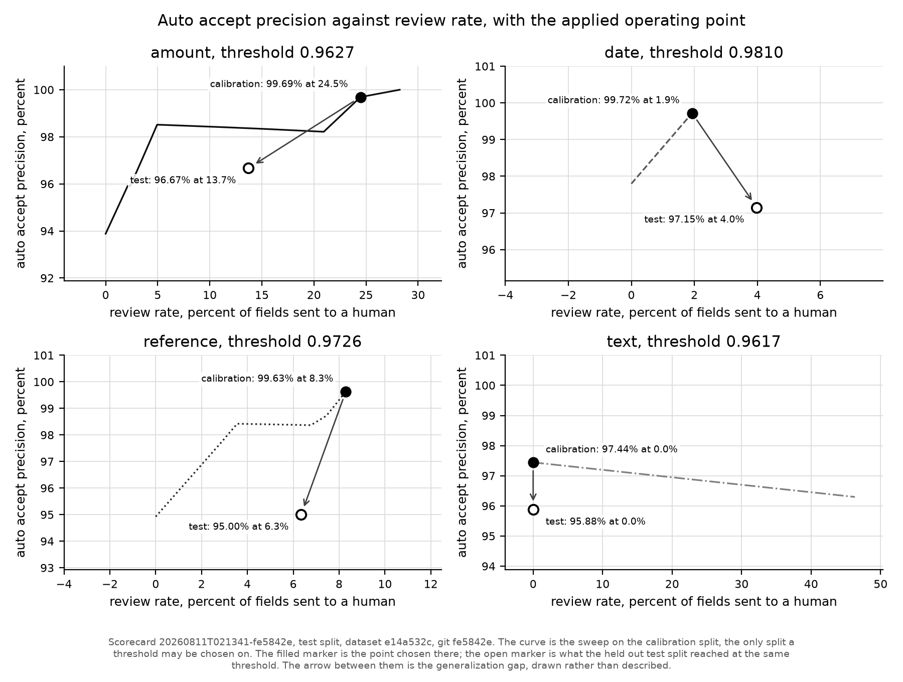

# Crossfoot

Crossfoot reads dealership statements, scores its own confidence on every field it
extracts, reconciles the result against the dealer ledger, and sends only the fields it
does not trust to a human.

Start with the worst number. On the held out test split, reference fields on the
`scan_heavy` tier come back **33.1 percent** correct, 47 of 142. Amounts on that tier are
44.6 percent, 37 of 83. A 17 character VIN on a bad photocopy gives seventeen chances to
read `0` as `O`, and no reader gets all of them.

The claim is not accuracy. The claim is that the system knows which fields to distrust.
Confidence is fit on the train split, thresholds are chosen on the calibration split, and
these are the numbers the held out test split produced at those thresholds:

| Held out test split | Value |
| --- | --- |
| Fields scored | 1880 |
| Auto accept precision | 96.02 percent |
| Review rate | 6.38 percent |
| Injected discrepancies caught, matching engine fed truth | 71 of 71, zero false detections |
| Injected discrepancies caught, matching engine fed extractions | 63 of 71, 66 false detections |

A reviewer looks at about one field in sixteen of what came back. That is not the whole
workload: 314 of the 2194 printed fields were never returned by any extractor, so they
appear in no queue and in no precision figure either. Counting a human's real burden as
reviewed plus never returned against everything printed gives 19.8 percent.

The last two rows are the same matcher over the same discrepancies, once on ground truth
statement lines and once on the lines the pipeline actually read, so the distance between
them is extraction error on the lines. Both modes take the dealer, the document type, the
marque and the statement period from the manifest, because the reconciler blocks on those
and no extractor produces them.



Filled marker: the operating point chosen on the calibration split. Open marker: what the
held out test split reached at that same threshold. The arrow between them is the
generalization gap, drawn rather than described. Figure and numbers both come from
`scorecards/20260811T021341-fe5842e/`.

[docs/walkthrough.md](docs/walkthrough.md) is the same system in diagrams and screenshots:
what happens to one document, how a field earns or loses trust, and what the three review
surfaces actually look like.

## The problem

Every month an OEM sends each of its dealers a stack of statements: parts billing,
warranty credit memos, floorplan interest, incentive payments. Each one is a list of line
items the factory believes it owes or is owed. The dealership has its own ledger of what
it believes. Someone in the office reconciles the two by hand.

The documents arrive as clean PDFs, as photocopies of photocopies, as CSV exports with
whatever header names the export tool felt like, and as spreadsheets with merged title
cells. A missed short pay or a duplicated claim is real money, and the errors that matter
are the ones nobody has time to look for.

The interesting part is not reading the documents. It is knowing which readings to act on.

## What it does

```
gen -> extract -> confidence -> reconcile -> review
```

1. **Generate.** `crossfoot gen` builds the corpus: a ledger, statements composed from it,
   discrepancies injected into the statements, then rendering to PDF through Chromium,
   degradation to scans through Augraphy at 200 DPI, and messy CSV and XLSX exports. Every
   printed string is recorded, so ground truth is known by construction rather than
   labelled after the fact.
2. **Route and extract.** Documents are routed by file signature, never by the manifest,
   so a mislabelled artifact fails the way it would in production. Digital PDFs, CSVs and
   XLSX go to deterministic extractors. Scanned PDFs are rasterized and sent to a vision model
   under a JSON schema, sampled twice per document (temperature 0, then temperature 0.4
   with the prompt field order shuffled) so per field agreement becomes a signal.
3. **Score confidence.** Each field gets a `FieldSignals` record: self consistency across
   the two samples, a VIN check digit validator, a date window read off the other dates the
   same extraction produced, a grammar match against the marque the document's own
   reference numbers vote for, whether the document's line amounts crossfoot to its printed
   total, a confusable glyph ratio over `{O0, I1l, S5, B8, Z2}`, and the route the router
   chose from the file's bytes. A logistic regression per field family, hand rolled in
   numpy, turns those into a probability. Every one of those is computable from the
   artifact alone; truth enters a fit only as the label on a row.
4. **Reconcile.** Three passes against the ledger: exact reference plus amount, exact
   reference with a differing amount, then a fuzzy pass scored on reference similarity,
   amount proximity, and date proximity. Unmatched lines and unconsumed ledger entries
   become typed exceptions with signed dollar impact.
5. **Review.** `crossfoot serve` builds a SQLite review database and serves a keyboard
   driven queue sorted by ascending confidence, with the cropped pixels the value came
   from next to it, plus an exceptions dashboard ranked by dollars. Corrections are append
   only: the original extraction stays recoverable as evidence and as a future eval label.

## Results

All figures below are the held out test split, from
`scorecards/20260811T021341-fe5842e/scorecard.json` unless named otherwise.

### Per field accuracy by tier

Canonical accuracy, correct over the fields the artifact actually printed:

| Family | clean digital | scan light | scan heavy | csv | xlsx |
| --- | --- | --- | --- | --- | --- |
| amount | 95.8 (205/214) | 74.1 (103/139) | 44.6 (37/83) | 100.0 (53/53) | 89.2 (33/37) |
| date | 97.3 (178/183) | 73.7 (87/118) | 55.6 (40/72) | 100.0 (53/53) | 89.2 (33/37) |
| reference | 93.2 (287/308) | 69.5 (130/187) | **33.1 (47/142)** | 100.0 (90/90) | 93.5 (58/62) |
| text | 93.2 (151/162) | 73.1 (76/104) | 56.2 (36/64) | 100.0 (53/53) | 100.0 (33/33) |


Most of the scanned tier loss is fields the model never returned at all, not fields it
returned wrong. That distinction matters more than it looks, because auto accept precision
counts only what came back. Splitting the two:

| Family and tier | Returned, percent of printed | Correct, percent of returned |
| --- | --- | --- |
| amount, scan light | 74.1 (103/139) | 100.0 (103/103) |
| amount, scan heavy | 68.7 (57/83) | 64.9 (37/57) |
| date, scan light | 73.7 (87/118) | 100.0 (87/87) |
| date, scan heavy | 69.4 (50/72) | 80.0 (40/50) |
| reference, scan light | 73.8 (138/187) | 94.2 (130/138) |
| reference, scan heavy | 56.3 (80/142) | 58.8 (47/80) |
| text, scan light | 73.1 (76/104) | 100.0 (76/76) |
| text, scan heavy | 68.8 (44/64) | 81.8 (36/44) |

So when the confidence section below reports 97.15 percent precision on dates while this
table reports 73.7 percent accuracy on light scan dates, both are true and the denominators
differ: the model returned 87 of 118 dates and every one of them was right. It abstains
rather than guesses. That is defensible behaviour and it is not visible in a precision
number, which is why both tables are here.

Reference on heavy scans is still the cell where the model reads confidently and reads
wrong: 80 of 142 references returned, 47 of them right. That is the VIN transcription
problem, and it is exactly the cell the confidence model has to catch. Across the whole
test split the extractor produced 14 spurious fields, values that resolve to no truth field
at all, out of 1880 extracted.

### Confidence: what was promised, what held

Per family, the operating point chosen on the calibration split and what the held out test
split reached at that same threshold. Both points are in the committed sweep.

| Family | Threshold | Calibration precision | Calibration review rate | Test precision | Test review rate |
| --- | --- | --- | --- | --- | --- |
| amount | 0.9627 | 99.69 | 24.47 | 96.67 | 13.72 |
| date | 0.9810 | 99.72 | 1.93 | 97.15 | 3.98 |
| reference | 0.9726 | 99.63 | 8.29 | 95.00 | 6.34 |
| text | 0.9617 | 97.44 | 0.00 | 95.88 | 0.00 |

Every family lost precision on held out data, and every family missed the precision target
its threshold was chosen to hit. The targets are 99.5 percent for amounts and references,
99 percent for dates, 97 percent for text. On test they delivered 96.67, 95.00, 97.15 and
95.88. A threshold chosen to a target on one split does not carry that target to another,
and 52 calibration documents are a small sample doing a load bearing job.

Reference used to carry almost the whole review burden, at 64.60 percent on calibration,
because the reader it was scoring got 9.2 percent of heavy scan references right and no
scorer can separate readings that are nearly all wrong. It now reviews 6.34 percent. That
change came from replacing the model, not from touching the confidence code, which is the
most useful thing this project measured: the scorer is only as good as the spread it is
given, and a reader that is wrong almost everywhere leaves no spread to find.

Amount is now the family reviewing most, 13.72 percent. What it lost when the manifest
features were removed was a sign check against the line type, and no extractor produces a
line type, so for a single amount what remains is whether the text parsed. The arithmetic
standing in for it is the document level crossfoot and the residual suspect flag beside it.

Text still auto accepts everything. Its threshold sits below the confidence of every field
in the family, which is the model saying it distrusts none of them, so its 95.88 percent is
earned by the reader abstaining on hard pages rather than by the scorer catching anything.

### What the honest signals cost

These numbers are worse than an earlier run of this pipeline reported, and both reasons are
worth knowing. The first is here: four confidence features were read out of the dataset
manifest rather than out of the artifact, which is information no real document carries.
The second was that 26 of the 210 documents were being discarded before they were ever
scored, and that story is under "Route by bytes" in the design notes.

`SignalContext` used to be handed a `ManifestRecord`. Four of the values it took from there
have no inference time equivalent, and `src/crossfoot/scoring.py`, which materializes the
review database the API and the UI read, took the same route. What replaced each:

| Signal | Was | Is |
| --- | --- | --- |
| categorical base rate | the generator's `quality_tier`, one hot encoded | `ExtractionRoute`, read off the file's bytes by the router |
| date window | the true `period_start` and `period_end` | the statement date this extraction produced, or the middle of the document's other dates, and never a date's own |
| amount validator | parsed, and the sign agreed with the true line type | parsed |
| reference grammar | the true `oem`'s grammar | the marque this document's own reference numbers vote for, falling back to whether any marque recognizes the value |

Measured by refitting on train, rechoosing thresholds on calibration and rescoring test
each time, the tier label alone was worth about 16 percentage points of review rate:
merging `scan_light` and `scan_heavy` into one scanned value cost 4 points, and removing
tier information entirely cost 37. The route lands between them, because a document does
announce whether it carries a text layer and does not announce how badly it was
photocopied. Those three figures were measured on the earlier corpus and no committed
scorecard carries them, so they are the shape of the effect rather than current numbers.

`tests/unit/test_truth_boundary.py` walks the AST of every module under `src/crossfoot`
except the generator, the eval harness and the manifest model itself, and fails the build
if any of them imports the manifest or mentions `manifest.json`. It also pins the field
lists of `FieldSignals` and `SignalContext`, because an import guard alone would not catch
the leak coming back as a new field.


Expected calibration error on test, computed from the committed calibration bins with
`expected_calibration_error` in `src/crossfoot/confidence/calibration.py`: amount 0.039,
date 0.042, reference 0.058, text 0.044. The contract sets a ceiling of 0.05 and calls for
Platt scaling fit on the calibration split above it, which this run applies: the scorecard
carries the slope and intercept per family in `platt_scaling`, so a published figure can be
rebuilt from the committed file rather than taken on trust. Reference is still over the
ceiling at 0.058. Platt is a monotonic transform, so it corrects how honest a probability
is and cannot change which fields the queue holds.

### Reconciliation: how much of the error is extraction

The matching engine runs in two modes over the same code. Oracle mode feeds it ground
truth statement lines. End to end mode feeds it extracted lines. The distance between them
is the error extraction adds to matching.

| Exception type | Oracle caught | End to end caught | End to end false detections |
| --- | --- | --- | --- |
| missing from ledger | 14/14 | 13/14 | 22 |
| missing from statement | 13/13 | 13/13 | 38 |
| amount mismatch | 14/14 | 13/14 | 6 |
| duplicate | 10/10 | 8/10 | 0 |
| short pay | 7/7 | 5/7 | 0 |
| timing difference | 13/13 | 11/13 | 0 |
| **total** | **71/71, zero false** | **63/71 (88.7 percent)** | **66** |

Sources: `scorecards/recon-oracle-20260811T021348/scorecard.json` and
`scorecards/recon-end_to_end-20260811T021344/scorecard.json`, same dataset hash, same test
split, same commit. By dollars, end to end recovers 356,934.28 of 367,465.71 injected, or
97.1 percent, because the largest discrepancies sit on lines that were read correctly.


The 66 false detections are the remaining weakness, and most are one failure mode: when
extraction misses a statement line, the ledger entry it should have matched looks
unclaimed, and the engine reports it as missing from the statement. Recall degrades
gracefully under extraction error; precision does not.

Both halves moved together when the vision model changed, which is the point. Caught rose
from 51 to 63 and false detections fell from 150 to 66, because a line that is read is a
line that cannot be reported missing. Reconciliation precision was never a matching problem
to solve on its own.

Oracle mode is not vacuously perfect. An earlier committed oracle run over the train
split, `scorecards/recon-oracle-20260809T090106/scorecard.json` at commit `433d01a`,
caught 137 of 141 with 4 false detections.

### Cost

The published run made 237 vision calls over 84 documents, all served by
`nvidia/nemotron-nano-12b-v2-vl`. Priced at the list rate in `src/crossfoot/constants.py`,
the whole corpus across all three splits comes to 0.2214 USD, about **0.00122 USD per
processed document**, which is the figure the review surface shows.

The denominator is the 182 documents that produced fields, not all 210: an unreadable file
costs nothing to extract and would flatter the number by sitting in it. Of those 182, only
the scanned ones reach a model, so a document that costs anything costs about 0.0026 USD.
The other 126 are read by pdfplumber, the csv reader, or openpyxl and never touch a
provider at all, which is the whole point of routing by file signature first.

A run id names a split and a dataset rather than one invocation, so the ledger also holds
calls from attempts whose output was discarded. It is append only and keeps them, because
what was spent is not editable by whether the output was kept. The figures above are scoped
to the attempt that produced the committed extractions, which is the same scoping the
scorecard uses to name its models.

This is the one number on this page that is not in a committed scorecard. `crossfoot eval`
does not populate the scorecard's `costs` section yet, so every committed scorecard has
`"costs": []`, and the figure above comes from the run's own cost ledger under `data/`,
which is not committed. Treat it accordingly.

## Why the numbers are worth anything

**Ground truth by construction.** Nothing is hand labelled. The generator composes each
statement from a ledger it also writes, injects discrepancies it records, and the renderer
captures every string it prints into `rendered_values`. Truth is what was printed, known
before any extractor sees the file.

**A field counts as expected only if the artifact printed it.** CSV exports carry no
statement totals; XLSX exports carry only some header fields. Counting those against the
extractor measured the format, not the pipeline. So the scorecard publishes both
denominators side by side, `fields_in_truth` and `fields_expected`, and a reader can judge
the change instead of taking it on trust. On this test split they are 2227 and 2194.

**Document level splits, and the discipline is code.** Splits are assigned per document,
stratified by document type and quality tier, 50/25/25 across 105 train, 52 calibration,
and 53 test documents, so no field from one statement can appear on both sides of a split.
`fit_scorers` refuses any split but train and `choose_thresholds` refuses any split but
calibration, both checking the caller's stated intent and the split tag on every row.
Misuse raises `SplitDisciplineError` rather than quietly inflating a scorecard.
`sweep_point`, which measures a threshold already chosen, is deliberately not guarded and
carries a docstring saying why.

**Nothing that scores a document can see the answers.** One test walks the AST of every
module under `src/crossfoot` and fails if any of them imports the generator or the manifest
models, or mentions `manifest.json`. Three modules and two directories are exempt, the
generator that writes the answer key and the eval harness that scores against it, and the
exemption is by directory, so this catches the accidental leak rather than a determined
one. It caught a real one: an earlier build named three packages instead, which left
`scoring.py` outside the net and let the manifest reach the review database. The stronger
half of the same test pins the exact field lists of `FieldSignals` and `SignalContext` by
set equality, so a leak arriving as a new signal fails even when the import graph is
clean.

**Scorecards are committed with their git sha.** Each carries `run_id`, `git_sha`,
`dataset_config_hash`, `master_seed`, and the split it reports. The dataset hash on all
three test split scorecards here is `e14a532c` and the seed is 42, and a corpus regenerated
from that seed matches this one byte for byte, every file and every tier. So the dataset a
reader builds is the dataset these numbers were measured on, which `just repro` checks
cell by cell for the tiers that need no model.

The scorecard also records every model that served the run, because which model reads a
scanned page turns out to matter more than anything else in this pipeline, and a number
that does not name its reader is not reproducible in any useful sense.

**Figures live next to the scorecard that produced them.** `crossfoot plots` writes each
PNG into the scorecard's own directory and stamps the run id, split, dataset hash, and git
sha into the caption. A figure cannot drift from its numbers because it has nowhere else
to live.

## Reproduce it

Requires Python 3.12 and [uv](https://docs.astral.sh/uv/).

```bash
just setup                  # uv sync, pre-commit hooks, playwright chromium
just                        # ruff, mypy strict, pytest
```

Check the published numbers against a corpus you generate yourself. No API key, no GPU:

```bash
just repro
```

That regenerates the corpus from seed 42 into its own directory, scores the deterministic
tiers, and compares them cell by cell with the committed scorecard. It compares 12 cells and
should report 0 differences. It deliberately does not compare the two scanned tiers, and it
says so rather than passing quietly: those need a vision model, and `scan_heavy` does not
regenerate byte identically, so its images would not be the images the published numbers
were read off.

The individual steps, if you want them:

```bash
uv run crossfoot gen --seed 42 --out data/dataset
uv run crossfoot eval --dataset data/dataset --split test
uv run crossfoot reconcile --dataset data/dataset --split test --mode oracle
```

`gen` renders through Playwright Chromium and degrades scans through Augraphy, so it is
the slow step. The same seed reproduces all 222 files byte for byte, measured by generating
the full profile twice and hashing every file.

That took a fix worth naming, because the obvious one does not work. Augraphy's
`DirtyRollers` calls `random.randint` from inside a numba compiled function, and numba
implements the `random` module in nopython mode with its own generator state. Seeding the
interpreter's `random` and numpy per page, which the generator already did, cannot reach
it. Only a seed call made from inside compiled code does. That augmentation is chosen on a
coin flip, which is why exactly 17 of the 32 `scan_heavy` documents used to differ rather
than all of them. `tests/contract/test_generator_determinism.py` pins the heavy tier
directly against `degrade_to_scan` on four seeds covering both pipeline branches, because
generating the full profile is far too slow for CI and one heavy document in the small
profile would exercise the compiled path only half the time.

The scanned tier needs a vision model that also supports `json_schema` response formats.
Point `CROSSFOOT_LLM_BASE_URL` at any OpenAI compatible endpoint, local or hosted, or set
a provider key from `.env.example`:

```bash
uv run crossfoot probe                                              # what is reachable
uv run crossfoot extract --dataset data/dataset --split train --mode live
uv run crossfoot extract --dataset data/dataset --split calibration --mode live
uv run crossfoot extract --dataset data/dataset --split test --mode live --resume
uv run crossfoot calibrate --dataset data/dataset                   # fit, then choose
uv run crossfoot eval --dataset data/dataset --split test           # scores the saved run
uv run crossfoot reconcile --dataset data/dataset --split test --mode end_to_end
uv run crossfoot plots
```

To run the product rather than the eval, build a corpus and extract it first. `serve` reads
`data/dataset` and `data/extractions`, and neither is committed, so a clean checkout that
skips these two steps gets a queue reporting zero fields:

```bash
uv run crossfoot gen --seed 42 --out data/dataset
uv run crossfoot extract --dataset data/dataset --split test --mode replay
cd frontend && npm install && npm run build && cd ..
uv run crossfoot serve --dataset data/dataset
```

The extract step needs no key and no GPU, and it will report failures. Replay serves the
vision path from committed cassettes and there are none for this corpus, so 31 of the 53
test documents extract and the 22 scanned ones fail with `no cassette`. That is the
expected result without a model, and it takes a few minutes because each failure exhausts
its retries first. What you get is the deterministic tiers, which is enough for the queue,
the dashboard and the correction loop to work end to end. Run the live extraction above to
fill in the scanned documents.

Note this is a different directory from `just repro`, which writes to `data/repro` on
purpose so a reproduction attempt cannot overwrite the corpus the published extractions
were read from.

Honest scope. `crossfoot eval` scores the saved extractions from `crossfoot extract` when
they exist and falls back to the offline routes when they do not, so running it on a fresh
checkout scores CSV and digital PDF only and every scanned document reads as zero. The
scanned tier numbers depend on which model read the page, and they depend on it more than
on anything else here, so reproducing that column means using the model the scorecard
names. `data/` is not committed, so the corpus, the extractions, and the ledgers are
rebuilt locally rather than downloaded.

## Design notes worth defending

**Route by bytes, and distrust the word "unprocessable".** 26 of the 210 documents were
being dropped before they were scored, and every one had a different cause wearing the same
label. 17 XLSX files carried an `unrecognized` verdict from a router that predated the XLSX
extractor, so the fix is that a resumed run re asks any document whose route now has an
extractor rather than inheriting the old build's verdict. 8 scans had failed schema
validation twice and been recorded as bad documents; every one of those responses had
stopped at exactly 4096 tokens, and nothing below 4096 ever failed, which is what identified
the serving context window rather than the model or the page. The last document was lost to
a provider timeout and was simply absent from the denominator, which is the failure worth
fearing most, because the scorecard still looked healthy.

The general lesson is that "the model cannot read this" is a conclusion three different
infrastructure faults will happily impersonate: a stale router verdict, a truncating context
window, and a dropped request. Each one was cheap to fix once named and expensive to leave,
because each showed up as an accuracy number rather than as an error.

**The provider was chosen by probing, not by a leaderboard.** Every candidate got one
direct call carrying an image and a `json_schema` response format, against its own default
model. The capability matrix in `docs/contracts-phase2.md` is the result, and it is a
matrix of what each provider would actually do rather than what a benchmark says it can.
Groq answered that content must be a string and that it does not support the
`json_schema` response format, so it is text only. Before that was known, a capability
blind spillover chain with Groq sitting second lost 36 of 105 documents in one run: a 400
is correctly classified as fatal, so those documents neither retried nor spilled over. The
vision pool is now capability filtered where it is constructed.

Probing kept paying. NVIDIA NIM advertises a `json_schema` response format and serves a two
field schema happily, then returns 500 on the frozen document schema, six times out of six
on an idle endpoint. The schema is still the specification, so it travels in the message
instead of beside it and the reply is validated here, which is where it was validated
anyway. Reading a provider's capability list would have missed that; a probe found it.

**With structured outputs, the schema is the specification, so do not restate it.** The
extraction prompt is one sentence: extract every field and every line item from this
document type. An earlier version described the shape in prose and listed the field names.
The smaller vision model then returned a schema valid response with an empty line array on
every scanned document, which read as an accuracy collapse rather than the prompt fault it
was. Naming internal field names (`vin`, `line_amount`) sent it hunting for column headers
the page never prints and it answered with correctly shaped rows whose every value was
null: invalid output on two document types and all null rows on a third. The reasoning is
kept in the docstring of `_user_prompt` in `src/crossfoot/extraction/llm_vision.py` so
nobody helpfully adds the detail back.

**Oracle mode is a reporting requirement, not a debugging convenience.** Running the
matching engine over ground truth lines and over extracted lines gives two numbers whose
difference is attributable. Without it, "we caught 65 percent of discrepancies" is one
number that could mean a weak matcher or a weak reader, and the fix for those is not the
same fix. `reconcile()` takes a `StatementDoc` in both modes so it is provably the same
code path.

**Correctness never depends on model reported coordinates.** Review crops come from
pdfplumber word boxes on the deterministic path, and from row stripes detected by a
horizontal projection profile on the vision path. A model supplied bounding box only
refines a band it already agrees with, and is discarded silently when it fails a sanity
check. Bounding boxes are never scored.

Row detection succeeds less often than that description suggests, and a multi page scan
never bands at all, because the row locator is only handed a row position for single page
documents. The crop caption says which of the two a reviewer is looking at, so a whole page
fallback tells them to find the value themselves rather than implying a tight crop that is
not there.

## Limitations

**The documents are synthetic.** Realistic in format, built from four fictional marques,
with the paperwork conventions of real OEM statements and none of their content. No real
dealership has run this. Real scans are dirtier than a generator knows how to imitate and
the discrepancy mix is one a script chose, so read the numbers as a measurement of the
method rather than a forecast of production accuracy.

**Four of the 53 test documents were never read.** Three light scans and one heavy scan
failed schema validation twice, so they carry no fields and score zero across every family.
They are counted in every denominator on this page rather than dropped, because a document
the pipeline could not read is a result and not an absence.

**The confidence model still misses its targets.** Reference sits at 0.058 expected
calibration error against a 0.05 ceiling even after Platt scaling. Every family missed the
precision target its threshold was chosen for, by between one and four points. Text sends
nothing to review at all, so the scorer separates nothing there and its precision is earned
by the reader abstaining rather than by the scorer catching anything.

**End to end reconciliation precision is still the weak half.** 66 false detections against
63 true, almost all of one kind: a missed statement line leaves its ledger entry looking
unclaimed. Recall degrades gracefully under extraction error and precision does not. 97.1
percent of the injected dollars are recovered, because the large discrepancies sit on lines
that were read correctly.

**Prompt injection is defended structurally, not empirically.** Pages reach the model as
images and no page text is ever concatenated into a prompt, which is tested directly. What
is untested is whether a live model obeys an instruction printed on a page it read
correctly. The pipeline's answer to that is arithmetic rather than trust: a total that
contradicts its own lines fails the crossfoot check and goes to review.

**Single operator tool.** No authentication, no multi tenancy, and the review database is
rebuilt from the dataset rather than migrated.

## License

Apache-2.0
