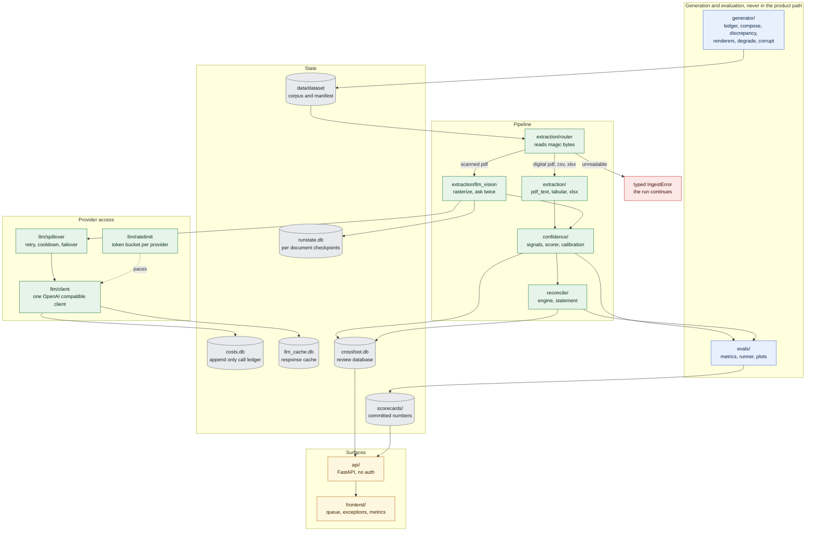
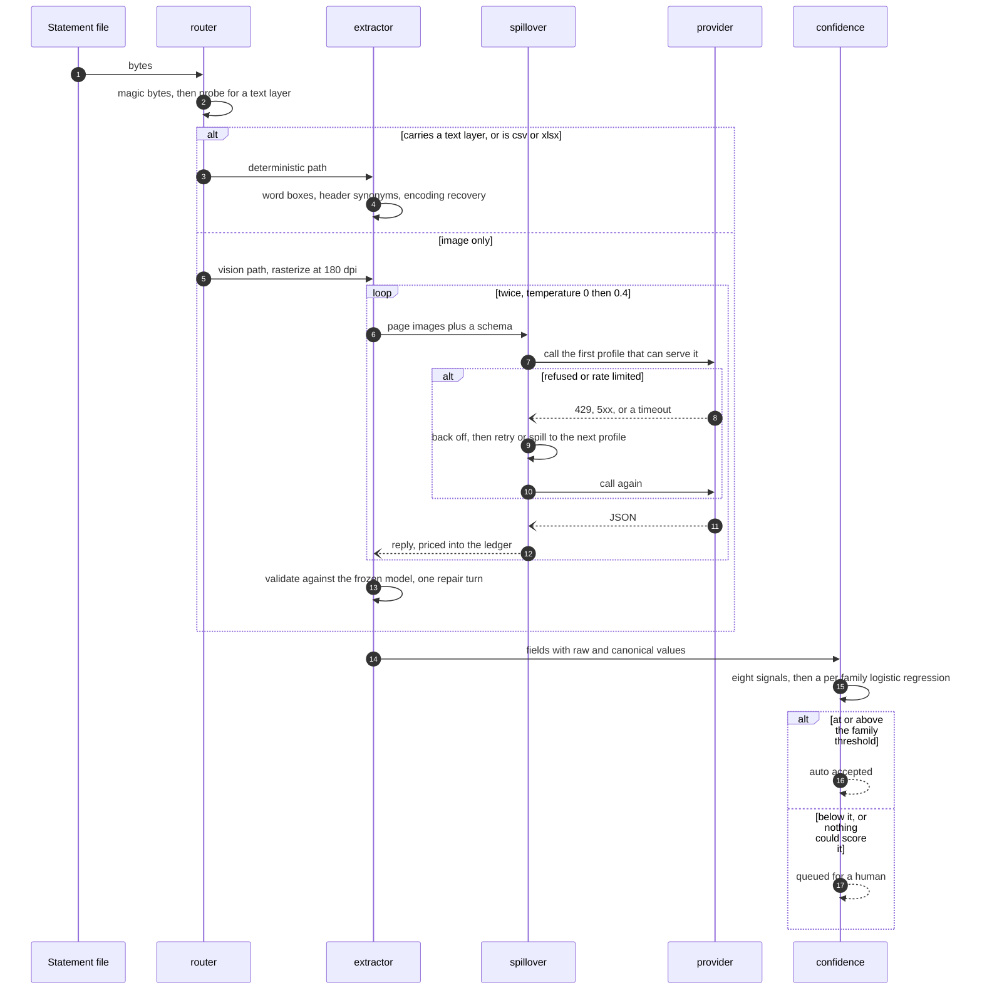
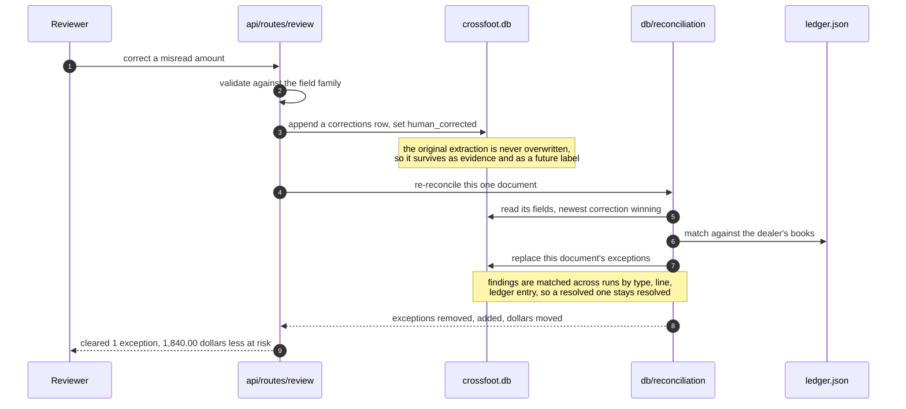
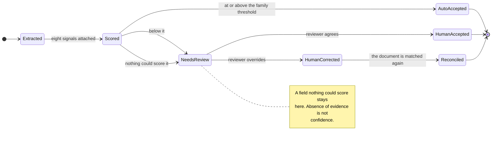
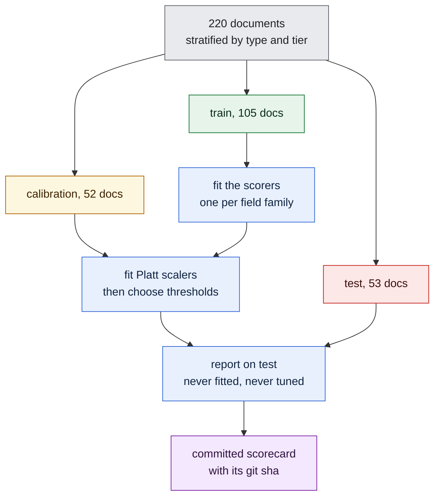
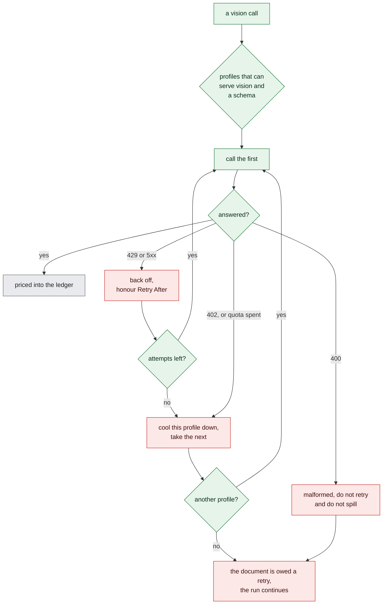
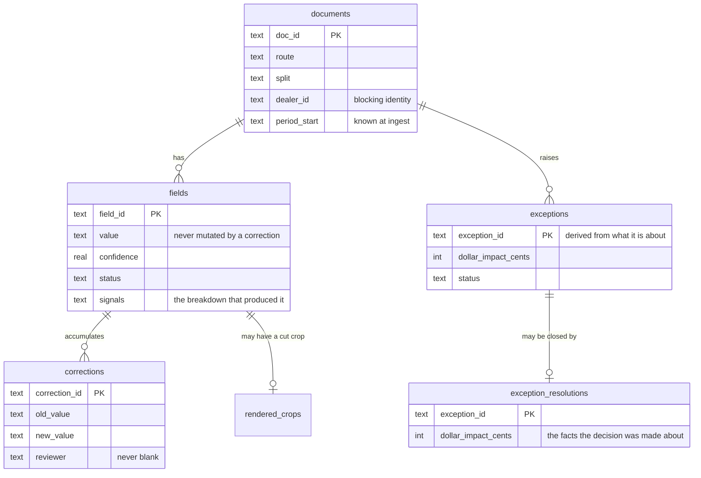

# Architecture

How Crossfoot is put together, and why the seams fall where they do. The numbers live in
the [README](../README.md); this is the shape of the thing.

Colour is meaningful throughout. Blue is generation and evaluation, which exists only to
make the numbers honest. Green is the production pipeline, the part that would run against
a real dealer's mail. Amber is what a human touches. Red is a failure that the run survives.
Grey is durable state on disk.

## The system

The blue box is the part that would not exist in production. It writes the answer key, and
an AST test fails the build if anything green ever imports it.

## What each package owns

| Package | Owns | Deliberately does not |
| --- | --- | --- |
| `generator/` | The corpus and the answer key | Know anything about extraction |
| `extraction/` | Bytes to `ExtractedDocument` | Decide whether a reading is right |
| `confidence/` | Signals to a probability, thresholds | See the manifest, ever |
| `reconcile/` | Statement lines against ledger entries | Care which extractor produced a line |
| `llm/` | One client, retry, spillover, cost, cache | Know what a statement is |
| `evals/` | Scoring against truth, scorecards, figures | Run in the product path |
| `db/` and `api/` | The review surface | Recompute any number the UI shows |

## Reading one document

Two samples matter because agreement between them is a signal, and disagreement is often
the only evidence that a character was guessed.

## A correction closing the loop

This is the part that makes it a product rather than a report.

The reconciliation the correction triggers is the same code the database build runs, so the
dashboard cannot drift from the scorecard.

## How a field earns or loses trust

## Where the numbers come from

The order matters: the Platt scaler is fit before the threshold is chosen, because a
threshold picked on uncalibrated scores names a different operating point once the scores
under it move. Both consume the calibration split, which is a real caveat and is recorded
in `docs/contracts-phase3.md`.

`fit_scorers` refuses any split but train and `choose_thresholds` refuses any split but
calibration. Both check the split tag on every row rather than the caller's word for it,
and raise `SplitDisciplineError` instead of quietly inflating a scorecard.

## Surviving a bad provider

Every arrow here was drawn after something went wrong on a real run.

The 400 branch is the expensive lesson. A provider that cannot read images answers 400, and
a 400 is correctly classified as fatal, so a capability blind pool with such a provider
second lost 36 of 105 documents in one run. The pool is filtered by capability where it is
constructed, and a document that fails everywhere is owed a retry rather than marked bad.

## State on disk

Two details carry weight. `exception_id` is derived from the finding's type, line and
ledger entry rather than from emission order, so re-reconciling names the same finding the
same thing and a reviewer cannot close one exception while reading another. And a
resolution stores the money it was made about, so a re-derivation that moves the amount
reopens the finding instead of leaving a note about nine dollars closing a six figure
discrepancy.

`data/` also holds three stores the review database does not own: `runstate.db` for per
document checkpoints, which is what makes `--resume` safe; `costs.db`, an append only
record of every call attempt; and `llm_cache.db`, keyed on model, prompt and image digest.

## Further reading

- [walkthrough.md](walkthrough.md) walks the three screens with screenshots.
- [contracts-phase1.md](contracts-phase1.md), [phase 2](contracts-phase2.md) and
  [phase 3](contracts-phase3.md) are the frozen interfaces, each amended in place with
  dated clarifications when reality disagreed with them.
