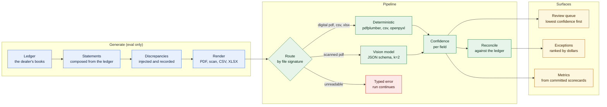
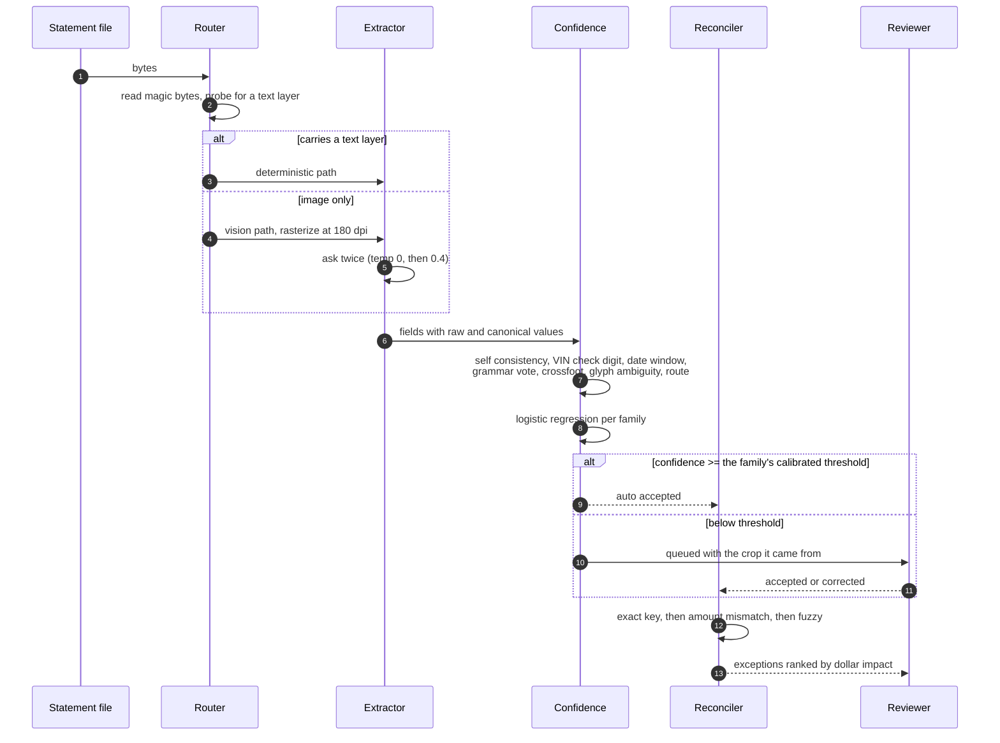
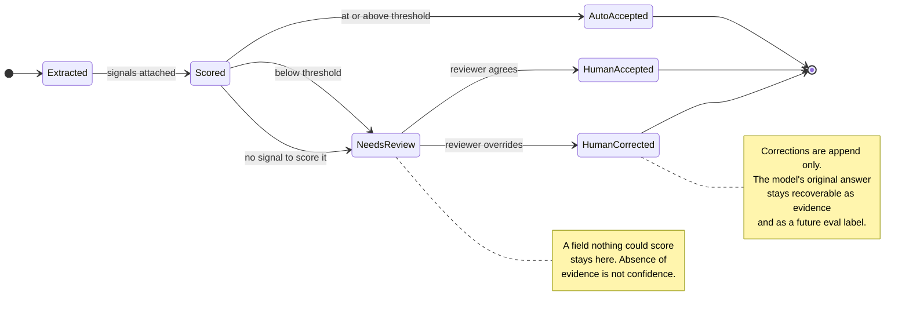
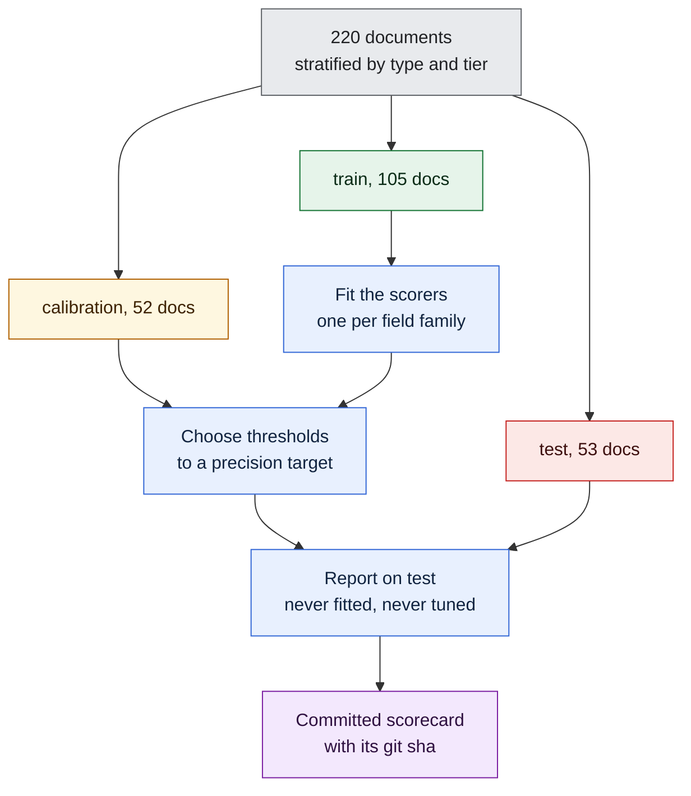

# Crossfoot: how it works, end to end

A run of the whole system, in the order you would meet it. Every screenshot is
regenerated by script from a live server, so nothing here is a mockup.

## Architecture



The generator exists only to make the eval honest. Ground truth is known by
construction because every printed string is recorded as it is rendered, so no
one had to label anything afterwards. The pipeline never reads that record: it
routes on the file's own bytes, the same way it would in production.

## What happens to one document



The two samples matter: agreement between them is a signal, and disagreement is
often the only evidence that a character was guessed.

## How a field earns or loses trust



## Where the numbers come from



The split discipline is enforced in code, not by convention: the calibration
module raises rather than fit on anything but train, or choose a threshold on
anything but calibration, and it checks the rows it was handed rather than
trusting the label it was given.

## Running it

Generate the corpus, extract, score, then serve. The first three need no API key
if you stay on the deterministic tiers.

```bash
just setup
crossfoot gen --seed 42 --out data/dataset --profile full
crossfoot extract --dataset data/dataset --split test --mode replay
crossfoot eval --dataset data/dataset --split test
crossfoot serve --dataset data/dataset --port 8000
```

The scanned tier needs a vision model. Point `CROSSFOOT_LLM_BASE_URL` at any
OpenAI compatible endpoint, local or hosted, and rerun `extract` with
`--mode live`. The published numbers were produced against a local
`qwen2.5vl:7b` served by Ollama, after free tier quota ran out mid corpus.

Run `just model` first if you serve it locally. Ollama's default context is
4096 tokens, which is enough for the prompt and most of an answer but not for
the longest statements, so generation stops mid object and the JSON never
parses. It reads as a document the model could not handle. Eight documents were
recorded that way before the cause was found, every one of them cut off at
exactly 4096 tokens.

## The review queue


Fields are ordered by ascending confidence, so the least trusted reading is
first. Each one shows the pixels it came from beside the value, and says why it
is in the queue rather than only that it is.

The headline counts this database, every split together, and it falls as
reviewers work. It is deliberately not the published review rate, which is
measured on the held out split at a fixed threshold and does not move. Two
numbers that look alike and mean different things is how a reader ends up
trusting the wrong one, so the page says which is which and links to the other.

## Exceptions


Reconciliation output, ranked by absolute dollar impact. Each row expands to the
statement line beside the ledger entry it disagrees with.

## Metrics


Every figure is read from a committed scorecard. The page computes no accuracy
of its own, and each number names the split it came from. The tiles under "This
database as it stands" are the exception that proves it: they are counted live
and they move, so they sit in their own section rather than beside figures that
do not.

The sweep panels carry two markers each. The filled one is where the threshold
was chosen, on calibration. The open one is what the held out split delivered at
that same threshold. Every family missed its target, and the arrow between the
markers is how much by.
